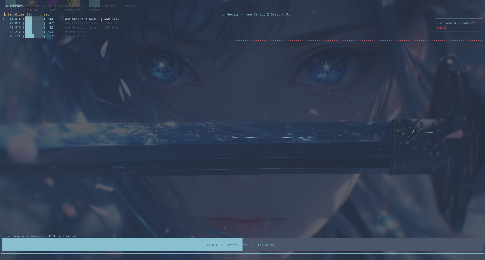

# 🌡 Thermometer App

Rust ile yazılmış, terminal tabanlı sıcaklık sensörü monitörü. MVC mimarisi ve `ratatui` ile anlık görselleştirme sunar.



---

## Özellikler

- Tüm sistem sıcaklık sensörlerini listeler (NVMe, CPU, disk vb.)
- Her sensör için anlık sıcaklık, blok bar ve oturum maximumu
- Seçili sensörün son 60 okumasını Braille çizgi grafiğiyle gösterir
- Kritik eşik çizgisi grafikte kırmızı olarak işaretlenir
- Sıcaklığa göre renk: `Cyan → Yeşil → Sarı → Kırmızı`
- Herhangi bir sensör kritik eşiği geçince başlık uyarı verir
- `↑↓` veya `j/k` ile sensörler arasında gezinme
- MVC mimarisi: model / controller / view katmanları ayrık

---

## Kurulum

**Gereksinimler:** Rust 1.75+

```bash
git clone https://github.com/batuhankanra/thermometer_app
cd thermometer_app
cargo build --release
```

### CachyOS / Arch Linux

Sıcaklık sensörlerine erişmek için `lm_sensors` gerekebilir:

```bash
sudo pacman -S lm_sensors
sudo sensors-detect --auto
sudo modprobe coretemp
```

---

## Kullanım

```bash
# Direkt çalıştır
./target/release/thermometer_app

# Sisteme kur (her yerden çalıştır)
sudo cp target/release/thermometer_app /usr/local/bin/
thermometer_app
```

> Windows'ta sıcaklık verilerine erişmek için Yönetici olarak çalıştır.

---

## Klavye Kısayolları

| Tuş | İşlev |
|-----|-------|
| `↑` / `k` | Önceki sensör |
| `↓` / `j` | Sonraki sensör |
| `Q` / `Esc` | Çıkış |

---

## Proje Yapısı

```
src/
├── main.rs                      ← Event loop
├── model/
│   └── app_state.rs             ← Veri: AppState, SensorReading, ThermalStatus
├── controller/
│   ├── sensor_collector.rs      ← sysinfo → model güncelleme
│   └── input_handler.rs         ← Klavye → model güncelleme
└── view/
    └── ui.rs                    ← ratatui render
```

---

## Bağımlılıklar

| Crate | Amaç |
|-------|------|
| `sysinfo` | Sıcaklık sensörü verisi |
| `ratatui` | Terminal UI |
| `crossterm` | Cross-platform terminal kontrolü |

---

## Lisans

MIT